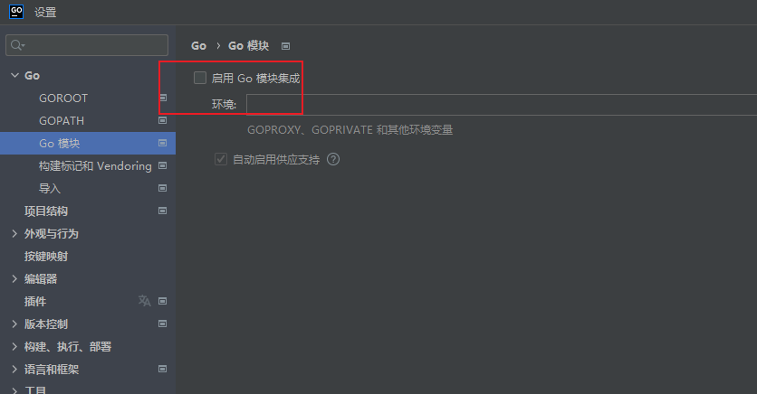

## 包的顺序
通过gopath方式

1.首选从GOROOT中的src中查找是否存在，如果不存在，然后再通过gopath中的src下寻找是否存在包(这个gopath还是在系统的环境变量中定义)
GOROOT
2.G gopath+src+项目名

注意: 编译器在找的时候,不管是GOROOT还是GOPATH都会这些基础上，添加一个src
但是在gopath的变量中，不需要添加src这一层，src是编译器能够自动添加

