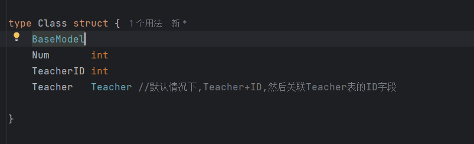
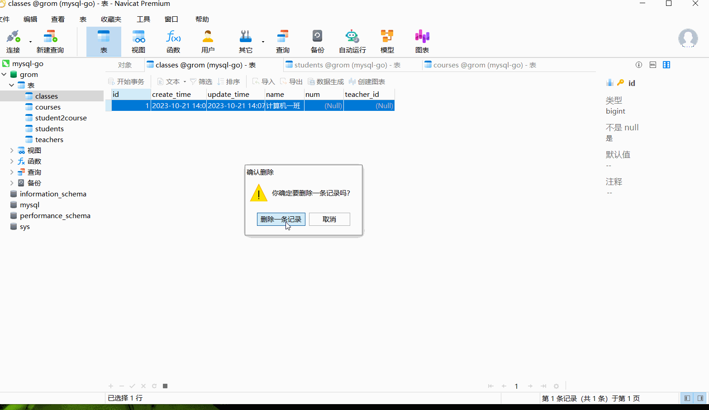

## 关于Class表的一些说明:

Teacher -->  Teacher理解，首先Teacher会自动添加ID,然后去关联表Teacher中的id字段。

在数据库中查看

## 关于Student表的一些说明
按照如图，解释

t1 := Teacher{ID=1,name="zhang",...}

c1 = Class{Name:"软件一班", TeacherID=1}

c1.Teacher (gorm: TeacherID=1 --> sql --> Teacher{ID=1,name="zhang",...})

总结: 

1) 多对多的时候,上面gorm会自动创建第三章关联表 student2course,当然也可以通过手动创建结构体实现，但是这样不利于自动获取值。

2) 多对多关系,一个学生可以有多门课程，当然，一门课程也可以有多个学生。所以就是多对多关系

## 外键关联自动删除

// constraint:OnDelete:CASCADE 添加此配置,就是连带外键的数据就自动删除

如果不添加此项,那就是在删除的时候，必须先要删除在关联使用表中的数据,才能删除

